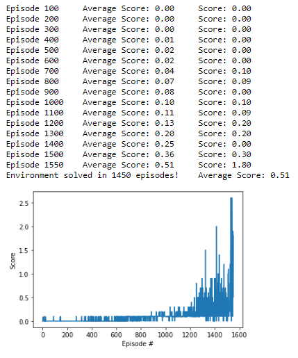

## Report

### Environment description

In this environment, two agents control rackets to bounce a ball over a net. If an agent hits the ball over the net, it receives a reward of +0.1. If an agent lets a ball hit the ground or hits the ball out of bounds, it receives a reward of -0.01. Thus, the goal of each agent is to keep the ball in play.

The observation space consists of 8 variables corresponding to the position and velocity of the ball and racket. Each agent receives its own, local observation. Two continuous actions are available, corresponding to movement toward (or away from) the net, and jumping.

The task is episodic, and in order to solve the environment, your agents must get an average score of +0.5 (over 100 consecutive episodes, after taking the maximum over both agents).

 
### Learning Algorithm

I've used the Multi-Agent Deep Deterministic Policy Gradients (MADDPG) algorithm to train the two agents to play tennis, which uses the framework of centralized training and decentralized execution. The DDPG algorithm is an Actor-Critic method, which are at the intersection of value-based methods such as Deep Q-Learning, and policy-based methods such as REINFORCE. During the training, the MADDPG critic uses extra information like states observed and actions taken by all the agents. As for the actors, there is one for each agent. Each actor has access to only its agent's observation and actions. 

As we have learned in the course, reinforcement learning is notoriously unstable when neural networks are used to represent the action values. Fortunately, we can address these instabilities by using two key features: Experience Replay and Fixed Q-Targets.

When the agent interacts with the environment, the sequence of experience tuples can be highly correlated. The naive learning algorithm that learns from each of these experience tuples in sequential order runs the risk of getting swayed by the effects of this correlation. By instead keeping track of a replay buffer and using experience replay to sample from the buffer at random, we can prevent action values from oscillating or diverging catastrophically. In this case, I've used a replay buffer that retains the 1,000,000 most recent experience tuples.

I've also used two separate networks with identical architectures for each of the actor and critic networks. This is referred to as Fixed Q-Targets. Without fixed Q-targets, we would encounter a harmful form of correlation, whereby we shift the parameters of the network based on a constantly moving target. The target Q-Network's weights are updated less often than the primary Q-Network. 

For the neural networks, I've chosen a 2-layer fully-connected architecture, each layer having 512 neurons. The input size is 24 for the state dimensions (3 values for each of the 8 variables corresponding to the position and velocity of the ball and racket) and it maps to 2 continuous outputs between -1 and 1 that correspond to the movement toward (or away from) the net, and jumping. The activation functions are RELUs. BatchNorm layers have been used for regularization.

The other hyperparameters I've used are:
* BATCH_SIZE = 128, the size of batches fed to the network while training
* GAMMA = 0.99, the discount factor 
* TAU = 1e-3, to soft-update of the target-networks weights
* LR_ACTOR = 1e-4, the learning rate of the actor network while training
* LR_CRITIC = 1e-3, the learning rate of the critic network while training
* WEIGHT_DECAY = 0, the L2 regularization weight decay

### Results

The environment was solved (average score of +0.5 over 100 consecutive episodes) after approximately 1450 episodes.

### Ideas for Future Work

* Tune hyperparameters
* Test different network achitectures
* Test different actor-critic methods like Asynchronous Advantage Actor-Critic (A3C), Advantage Actor-Critic (A2C) and Generalized Advantage Estimation (GAE)

